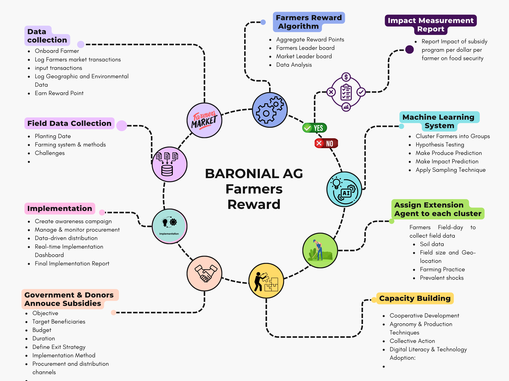

# Motivation 
Agricultural subsidy programs are a common policy tool used by governments to support farmers and promote food security. These programs are designed to increase the income of farmers, reduce the cost of food for consumers, and promote the production of certain crops. However, the effectiveness of agricultural subsidy programs is often limited by the challenge of targeting the right farmers.

Central to the identification of eligible farmers for agricultural subsidies is the issue of asymmetric information. While targeted subsidy programs are designed to reach only those who meet certain eligibility criteria, it is rarely, if ever, possible for central administrators to know precisely who meets the criteria at the local level.

# Farmers Reward
A platform the uses the decentrilized targeting approach to measure the impact of every dollar spent on food security based on farmers local market  and input transactions. 

## Features
- Farmers Market Directory
- Major Product Price Aggregation and Monitoring.
- Cultivated field directory by geo location plus soil information
- Clustering Algoirthm for Farmers Market
- Clustering Algoirthm for Cultivated Field
- Clustering Algoirthm for Farmers by Geo Location, Market, Farming Practices and others
- Farmers Reward System

## Tech Stack
- [Python 3.10](https://www.python.org/downloads/) or newer
- [Django 5.0](https://www.python.org/downloads/) or greater
- [Htmx](https://htmx.org/) or greater
- [Node.js 18.15 LTS](https://nodejs.org/) or newer (For Tailwind.CSS)
- [Git](https://git-scm.com/)

